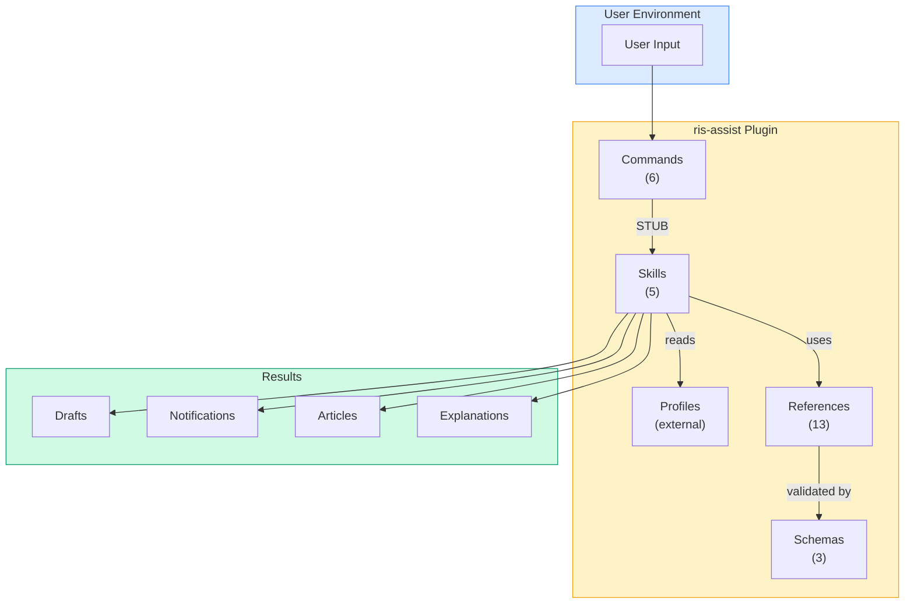
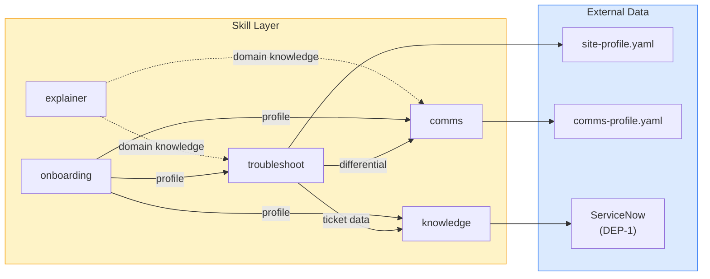
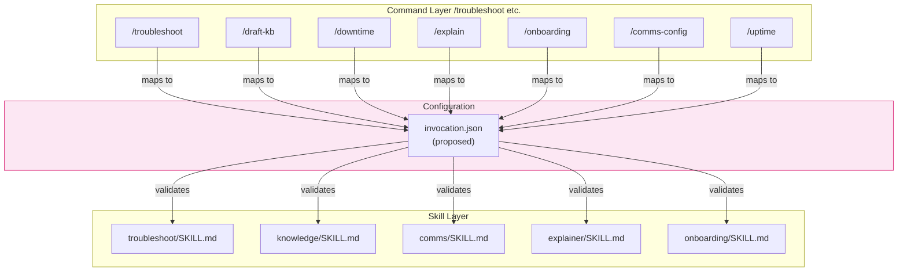

# RIS Assist Codebase Map

> **Repository**: `b08x/ris-assist`  
> **Type**: Claude Desktop Plugin (Documentation-driven)  
> **Health Score**: 2/5 (Foundational risk - enforcement mechanisms missing)  
> **Last Analysis**: 2026-08-07

---

## 🏗️ Architecture Overview

RIS Assist is a **documentation-centric plugin** for Claude Desktop, designed to support overnight radiology IT support engineers. Unlike traditional code-heavy repositories, this project uses **markdown as code** with a structured plugin architecture.

### Core Principle
**"Separate Profile from Plugin Code"** — Site-specific configurations live **outside** the plugin directory. The plugin ships generic templates; nothing site-specific enters this repository. This prevents data loss on updates and avoids leaking real system data.

### Plugin Structure

```
ris-assist/
├── plugins/ris-assist/                    # Main plugin content (installed via Claude)
│   ├── commands/                         # 7 slash commands (entry points)
│   │   ├── troubleshoot.md                    # /troubleshoot - Ticket clarification
│   │   ├── draft-kb.md                 # /draft-kb - Knowledge capture
│   │   ├── downtime.md                 # /downtime - Communications
│   │   ├── uptime.md                   # /uptime - Recovery / all-clear communications
│   │   ├── explain.md                  # /explain - Domain explanation
│   │   ├── onboarding.md                    # /onboarding - Cold-start interview
│   │   └── comms-config.md               # /comms-config - Profile customization
│   │
│   ├── skills/                           # 5 skills (implementation)
│   │   ├── troubleshoot/SKILL.md              # Differential-driven clarification
│   │   │   └── references/              # (none - logic in SKILL.md)
│   │   ├── knowledge/SKILL.md          # KB article drafting
│   │   │   └── references/              # kb-template.md, servicenow-format.md
│   │   │   └── scripts/                 # html_to_docx.py
│   │   ├── comms/SKILL.md               # Service notification drafting
│   │   │   └── references/              # comms-profile.schema.md, generic-templates.md, register-guide.md
│   │   ├── explainer/SKILL.md          # Domain concept explanation
│   │   │   └── references/              # 7 domain reference docs
│   │   └── onboarding/SKILL.md               # Site profile building
│   │       └── references/              # site-profile.schema.md
│   │
│   ├── agents/                          # Invocable subagents
│   │   └── analyst.md                   # Analyst persona (operational summary)
│   │
│   ├── examples/                        # Fictional site examples
│   │   ├── site-profile.example.yaml
│   │   ├── comms-profile.example.yaml
│   │   └── kb-article-*.example.html
│   │
│   └── .claude-plugin/
│       ├── plugin.json                 # Plugin metadata
│       └── marketplace.json            # Self-hosted marketplace config
│
├── demo/                               # Non-functional demo scripts
│   ├── build_narration.py              # Audio generation for demos
│   ├── coverage-demo.html
│   ├── narration*.{md,txt}
│   ├── persona-card.html
│   └── persona-narration*.{md,txt}
│
├── docs/                               # Project documentation
│   ├── adr/                           # Architecture Decision Records
│   ├── assets/                        # Icons, logos
│   ├── BACKLOG.md
│   ├── CONTRIBUTING.md
│   ├── DATA-PROVENANCE.md
│   ├── DEMO-comms.md
│   ├── DEMO-full.md
│   ├── GUARDRAILS.md (G1-G10)
│   ├── INDEX.md
│   ├── NON-GOALS.md
│   ├── PERSONA-SPEC.md (Single source of truth)
│   ├── PROJECT-INSTRUCTIONS.md
│   └── ROADMAP.md             # ServiceNow/MS 365 + parked forensics backlog
│
├── .claude-plugin/                     # Root plugin config
│   └── marketplace.json
│
└── root files
    ├── AGENTS.md
    ├── README.md
    ├── CHANGELOG.md
    ├── LICENSE (Apache-2.0)
    └── .gitignore
```

---

## 🎯 Key Architectural Decisions (ADRs)

| ADR | Decision | Status | Impact |
|-----|----------|--------|--------|
| ADR-0008 | Separate forensics plugin | Implemented | Message forensics is a separate plugin; troubleshoot detects need and escalates |
| ADR-0009 | KB article structure | Implemented | Standardized article shape (scope → differential branches → verification → cause → escalation) |
| ADR-0010 | Word-openable HTML default | Implemented | Manual mode uses HTML that opens in Word for editing |

**Note**: ADR-0011 (SkillContext schema) is **proposed** based on SIFT analysis to address cross-skill state leakage risk.

---

## 📊 Module Analysis

### Command Layer (`plugins/ris-assist/commands/`)

| Command | Skill | Purpose | Dependencies |
|---------|-------|---------|--------------|
| `/troubleshoot` | troubleshoot | Differential-driven ticket clarification | None |
| `/draft-kb` | knowledge | Draft KB articles from resolved tickets | ServiceNow MCP (optional) |
| `/downtime` | comms | Draft service-impact notifications | Comms profile |
| `/uptime` | comms | Draft recovery / all-clear notifications | Comms profile |
| `/explain` | explainer | Explain radiology IT domain concepts | Site profile (optional) |
| `/onboarding` | onboarding | Cold-start interview, profile building | None |
| `/comms-config` | comms | Customize comms profiles | Comms profile |

**Pattern**: All commands are STUBs that invoke their corresponding skill. The invocation mechanism is **currently implicit** (see [Issue #2](https://github.com/b08x/ris-assist/issues/2)).

### Skill Layer (`plugins/ris-assist/skills/`)

| Skill | Purpose | Key Files | References |
|-------|---------|-----------|------------|
| **troubleshoot** | Asks discriminating questions to route vague tickets | SKILL.md | None (logic embedded) |
| **knowledge** | Turns resolved tickets into KB article drafts | SKILL.md | kb-template.md, servicenow-format.md, html_to_docx.py |
| **comms** | Drafts service notifications (downtime, incidents, updates) | SKILL.md | comms-profile.schema.md, generic-templates.md, register-guide.md |
| **explainer** | Explains radiology IT concepts at adjustable depth | SKILL.md | 7 domain reference docs |
| **onboarding** | Builds site profile via interview or edits | SKILL.md | site-profile.schema.md |

**Common Pattern**:
```
SKILL.md (main logic)
├── YAML frontmatter: name, description
├── STUB marker referencing BACKLOG item
├── Behavior sections
└── "Not this skill" section (boundaries)
```

### Reference Layer

Each skill maintains its own `references/` directory for domain-specific knowledge:

- **knowledge**: Article templates, ServiceNow format guides
- **comms**: Profile schemas, template examples, registration guides
- **explainer**: 7 domain concepts (order lifecycle, accession vs order, MWL, report status, topology, vendor platforms, integration standards)
- **onboarding**: Site profile schema
- **troubleshoot**: None (logic is self-contained)

---

## 🔄 Data Flow Architecture

### Input → Processing → Output

```
User Input (Ticket/Request)
    ↓
Command File (STUB)
    ↓
Skill File (SKILL.md)
    ↓
Profile Lookup (External: site-profile.yaml, comms-profile.yaml)
    ↓
Output (Draft, Notification, Article, Explanation)
```

### Profile Separation Pattern

```
┌─────────────────────────────────────────────────────────────┐
│                    RIS Assist Plugin                            │
│  (plugins/ris-assist/) - Generic, versioned, installed         │
└─────────────────────────────────────────────────────────────┘
                           ↓ (reads)
┌─────────────────────────────────────────────────────────────┐
│                 User's Local Profiles                            │
│  (~/.claude-plugin/ris-assist/) - Site-specific, persistent     │
│  - site-profile.yaml                                           │
│  - comms-profile.yaml                                          │
│  - gap-log.json (proposed)                                     │
└─────────────────────────────────────────────────────────────┘
```

### Graceful Degradation Path

```
Skill Invoked
    ↓
Profile Field Missing?
    ├── Yes → Return "not in your site profile"
    │       → Use generic template
    │       → Label output "untuned"
    │       → Log gap (proposed)
    │
    └── No → Use profile data
            → Proceed normally
```

---

## 🌐 External Dependencies

| Dependency | Type | Purpose | Status |
|------------|------|---------|--------|
| ServiceNow MCP | External | Read incidents, write KB articles | DEP-1 (Blocked) |
| GitHub MCP | External | Repository operations | Available |
| Python 3 | Runtime | Script execution (demo, knowledge) | Required |
| Word | External | KB article editing (manual mode) | Optional |

**Critical Gap**: No timeout/circuit breaker for MCP calls (see [Issue #7](https://github.com/b08x/ris-assist/issues/7)).

---

## 📈 Complexity Metrics

| Metric | Count | Notes |
|--------|-------|-------|
| Total Files | 40+ | Mostly markdown |
| Commands | 6 | Slash commands |
| Skills | 5 | Core capabilities |
| Reference Docs | 13 | Domain knowledge |
| ADRs | 3+ | Architectural decisions |
| Guardrails | 10 | G1-G10 in GUARDRAILS.md |
| Non-Goals | 8 | Explicit boundaries |

---

## 🚨 Critical Issues (From SIFT Analysis)

### P0 - Foundational Risks

| Issue | Description | Impact | Fix |
|-------|-------------|--------|-----|
| [#1](https://github.com/b08x/ris-assist/issues/1) | PHI ingress gate unimplemented | **Critical** | Pre-receive hook scanning for PHI patterns |
| [#2](https://github.com/b08x/ris-assist/issues/2) | Command-to-skill invocation undocumented | **Critical** | Explicit `invocation.json` mapping |
| [#3](https://github.com/b08x/ris-assist/issues/3) | Persona versioning missing | **Critical** | Version pinning with CI check |
| [#4](https://github.com/b08x/ris-assist/issues/4) | ADR compliance tests missing | **Critical** | Test suite for architectural decisions |
| [#5](https://github.com/b08x/ris-assist/issues/5) | Persona rule duplication (G4) | **Critical** | Replace duplication with links + CI check |

### P1 - High Priority

| Issue | Description | Impact | Fix |
|-------|-------------|--------|-----|
| [#6](https://github.com/b08x/ris-assist/issues/6) | Forensics escalation trigger implicit | High | Explicit `forensics_needed` flag in troubleshoot |
| [#7](https://github.com/b08x/ris-assist/issues/7) | Gap telemetry + MCP timeouts missing | High | gap-log.json + timeout wrapper |

---

## 🎯 Component Relationships

### Mermaid: Plugin Architecture Diagram



### Mermaid: Skill Data Flow



### Mermaid: Command-Skill Mapping (Proposed)



---

## 📋 File Type Distribution

```
Markdown (.md)     │████████████████████│ 85%  (Commands, Skills, Docs)
YAML (.yaml/.json) │██████                    │ 10%  (Profiles, Config)
HTML (.html)       │████                     │  3%  (Demo files)
Python (.py)       │██                      │  2%  (Demo scripts)
TOML (.toml)       │░                       │ <1%  (cliff.toml)
```

---

## 🔍 God Nodes (High-Centrality Components)

Based on reference frequency and cross-component dependencies:

| Component | Type | Connections | Why It's Central |
|-----------|------|-------------|------------------|
| **AGENTS.md** | Documentation | High | Defines all architectural principles, skill behavior, command patterns |
| **PERSONA-SPEC.md** | Specification | High | Single source of truth for persona rules (referenced by all skills) |
| **plugins/ris-assist/commands/*.md** | Commands | High | Entry points for all plugin functionality |
| **plugins/ris-assist/skills/*/SKILL.md** | Skills | High | Implementation of all capabilities |
| **site-profile.schema.md** | Schema | Medium | Defines site profile structure (referenced by onboarding) |

---

## 🛡️ Governance Model

### Guardrails (G1-G10)

| ID | Guardrail | Purpose | Current Status |
|----|----------|---------|----------------|
| G1 | Confident interpolation | Prevent fabricated specifics | **At risk** (no enforcement) |
| G2 | Vocabulary import | Prevent assumption laundering | **At risk** (no enforcement) |
| G3 | Assumption laundering | Prevent silent assumption building | **At risk** (no enforcement) |
| G4 | Provenance collapse | Prevent duplicate persona rules | **Violated** (see Issue #5) |
| G5 | Silent correction | Prevent undocumented contradictions | OK (documented) |
| G6 | Fabricated specificity | Prevent unverified platform claims | **At risk** (no verification) |
| G7 | Scope inflation | Prevent feature creep | OK (BACKLOG.md tracked) |
| G8 | Demo ahead of substrate | Prevent premature demos | OK (ADR-0008) |
| G9 | Agreement drift | Prevent contradiction suppression | OK (documented) |
| G10 | Artifact substitution | Prevent derived document confusion | OK (documented) |

### Non-Goals (Explicit Boundaries)

1. Does not execute (no state-changing operations)
2. Does not guess (unrecognized segments = unknown)
3. Does not blur observation and inference (confidence marks required)
4. Does not make patient-safety-adjacent calls (flags for human)
5. Does not parse HL7 messages (separate forensics plugin)
6. Does not handle identified PHI (deterministic script gate at ingress)
7. Does not carry site config into the world (profiles live outside plugin)
8. Does not replace the senior analyst (onboarding reduces interruptions)

**Critical**: Non-goals #5 and #6 lack enforcement mechanisms (see [Issue #1](https://github.com/b08x/ris-assist/issues/1)).

---

## 📊 Backlog Status

### Current Priorities

| Priority | Epic | Items | Blockers |
|----------|------|-------|----------|
| **P0** | Foundation | 5 issues | None |
| **P1** | Resilience | 2 issues | P0 |
| **P2** | Features | KB pipeline, troubleshoot | DEP-1 (ServiceNow MCP) |
| **PX** | Parallel | Copilot integration | DEP-2 (BAA/PHI confirmation) |

### External Dependencies (DEP-#)

| ID | Dependency | Status | Impact |
|----|------------|--------|--------|
| DEP-1 | ServiceNow MCP access | Blocked | `/draft-kb` connected mode |
| DEP-2 | M365 Copilot PHI/BAA | Pending | Copilot integration |
| DEP-3 | IP/OSS publication approval | Pending | Public release |

---

## 🔧 Proposed Improvements (From SIFT)

### 1. invocation.json (P0)
Create explicit command-to-skill mapping with JSON Schema validation.

```json
{
  "commands": {
    "/troubleshoot": {
      "skill": "troubleshoot",
      "entry_point": "plugins/ris-assist/skills/troubleshoot/SKILL.md",
      "allowed_tools": ["Read", "Write", "grep"]
    }
  }
}
```

### 2. PHI Gate (P0)
Implement `hooks/pre-receive-phigate` using patterns from DATA-PROVENANCE.md Appendix A.

### 3. Persona Versioning (P0)
Add version fields to PERSONA-SPEC.md and all SKILL.md files with CI validation.

### 4. ADR Compliance Tests (P0)
Create `tests/adr-compliance/` with automated checks for each ADR.

### 5. Forensics Trigger (P1)
Add explicit `forensics_needed` flag to troubleshoot differential output.

### 6. Gap Telemetry (P1)
Implement `gap-log.json` for tracking skill fallback gaps.

---

## 🎯 Transformation Contracts

Each major component's purpose and constraints:

### `/troubleshoot` Command + Skill
- **Purpose**: Clarify vague tickets via differential diagnosis
- **Input**: Vague ticket text
- **Output**: Structured differential with confidence marks, recommended queue
- **Contract**: Asks one discriminating question at a time; overnight asks change-window question first
- **Non-Goal**: Does NOT perform message forensics

### `/draft-kb` Command + Skill
- **Purpose**: Convert resolved tickets into KB article drafts
- **Input**: Resolved incident (manual) or ServiceNow ticket (connected)
- **Output**: Word-openable HTML article + outstanding items + suggestions
- **Contract**: Conforms to site article template; separates observation from inference
- **Non-Goal**: Does NOT invent reproduction steps or screenshot sources

### `/downtime` Command + Skill
- **Purpose**: Draft service-impact notifications
- **Input**: Event details (class, audience, channel)
- **Output**: Formatted notification per comms profile variant
- **Contract**: Fills only stated facts; marks causal claims as confirmed/suspected
- **Non-Goal**: Does NOT infer ETA, cause, or impact scope

### `/explain` Command + Skill
- **Purpose**: Explain radiology IT domain concepts
- **Input**: Domain question or onboarding request
- **Output**: Explanation at appropriate depth
- **Contract**: Generic claims from references/; site-specific from profile; defaults to shortest answer
- **Non-Goal**: Does NOT guess if profile lacks detail

### `/onboarding` Command + Skill
- **Purpose**: Build and maintain site profile
- **Input**: Interview responses or edit requests
- **Output**: Updated site profile
- **Contract**: One question at a time; derive deltas from earlier answers
- **Non-Goal**: Does NOT invent system names, interfaces, or procedures

### `/comms-config` Command + Skill
- **Purpose**: Customize comms profiles
- **Input**: Template examples or edit requests
- **Output**: Updated comms profile
- **Contract**: One question per turn; derive don't enumerate
- **Non-Goal**: Does NOT auto-fill gaps

---

## 📚 Key Documentation Files

| File | Purpose | Audience | Update Frequency |
|------|---------|----------|------------------|
| AGENTS.md | Master architecture doc | Developers | Low (foundational) |
| PERSONA-SPEC.md | Persona rules | All | Low (foundational) |
| GUARDRAILS.md | G1-G10 rules | Developers | Low (foundational) |
| NON-GOALS.md | Explicit boundaries | All | Low (foundational) |
| BACKLOG.md | Feature prioritization | Developers | Medium |
| USER_STORIES.md | Feature requirements | Developers | Medium |
| DATA-PROVENANCE.md | Synthetic data policy | All | Low |
| INDEX.md | Documentation index | Users | Medium |

---

## 🔍 Search Patterns

### Finding Skill Implementation
```bash
# All skill files
grep -r "^---" plugins/ris-assist/skills/*/SKILL.md

# All command files  
grep -r "^---" plugins/ris-assist/commands/*.md

# Find STUB references
grep -r "STUB" plugins/ris-assist/
```

### Finding Architectural Rules
```bash
# Guardrails
grep -E "^G[0-9]+ " docs/GUARDRAILS.md

# Non-goals
grep -E "^- .*Does not" docs/NON-GOALS.md

# ADR decisions
grep -E "^## Decision" docs/adr/*.md
```

---

## 🎉 Next Steps

1. **Address P0 Issues** (Critical)
   - Implement PHI gate (Issue #1)
   - Create invocation.json (Issue #2)
   - Add persona versioning (Issue #3)
   - Create ADR compliance tests (Issue #4)
   - Remove persona duplication (Issue #5)

2. **Address P1 Issues** (High)
   - Add forensics trigger (Issue #6)
   - Add gap telemetry and MCP timeouts (Issue #7)

3. **Re-run Analysis**
   - After fixes, re-run SIFT protocol to validate health score improvement
   - Target: 4/5 health score

4. **Maintenance**
   - Keep invocation.json in sync with new commands/skills
   - Update ADR compliance tests with new ADRs
   - Monitor gap-log.json for common profile gaps

---

## 📞 Support

For questions about this codebase map:
- See [AGENTS.md](../AGENTS.md) for architectural principles
- See [sift-report-latest.md](sift-report-latest.md) for detailed SIFT analysis
- See GitHub Issues for tracked work

---

*Generated using codebase-mapper skill + SIFT protocol analysis*
*Last updated: 2026-08-07*
